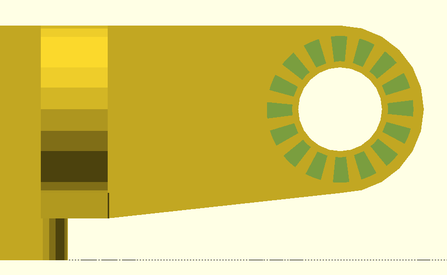

# VESA LiftPod Mount 
This project allows to add 4 LiftPod arms to your VESA mounted monitors - one in each direction.
To generate an custom STL file you will need to install OpenScad and tweek the parameters depending on your needs. Thingiverse's customizer might also allow to do this, but it's availability status is questionable at least.
# Parameters Description

### Mount Size 
You can choose from 2 VESA mount standards:
- 100x100 (default)
- 75x75

### Center Cutout Size 
The middle of the Lift Pod VESA Mount is empty to accomodate the arm of your VESA arm/stand. The more you remove the faster will be the print and the easier the mounting process will be.

Remember to adjust this valuess esspecially if you want to use the 75x75 standard. The recomended values are:
- 94 for 100x100 standard
- 68 for 75x75

### External Plate Height 
It's the height of the part that will be put directly against the monitor.
If your monitor has an indent for VESA mount use the depth of the indent plus 1-2mm.

If VESA mount in your monitor is flush with the back of it you can use 0mm to use less plastic.

### Internal Plate Height
This is the thickness of the plate that has the Lift Pod arms attached to it. 

### Screw Head Diamiter
Size of the cutout for the washer or the screwhead.

If you use multibit screwdriver it is wise to leave some more space for the scredrivers's rod. 12mm worked for me just fine, but your milage may wary.

### Screw Plate Thickness
Thickness of the mount under the screw. External and Internal Plates thickness does not affect the thickness of the Screw Plate. 

Bear in mind that the thicker the plate the shorter part of the VESA screw is inside the monitor. Please, check if most of the screw will be still inside the monitor before you start printing. 

Best way to do that is to measure the length of the VESA mount screw that came with your monitor or mounting arm and subtract from it the Screw Plate Thickness and thickness of your VESA arm/stand plate. If it is more than two thirds of the length then will probably be fine. Once more, please test the installed Lift Pod arm with the monitor on minimal height to prevent serious damage to the screen.

### Support Bars 
These are mainly to ease a bit the printing process. Depending on your print settings these can help or hinder with prinitng - it depends for example - wether you use External Plate or not.

Experiment with your print settings and check what works best with your slicer/printer.

With support bars

Without support bars